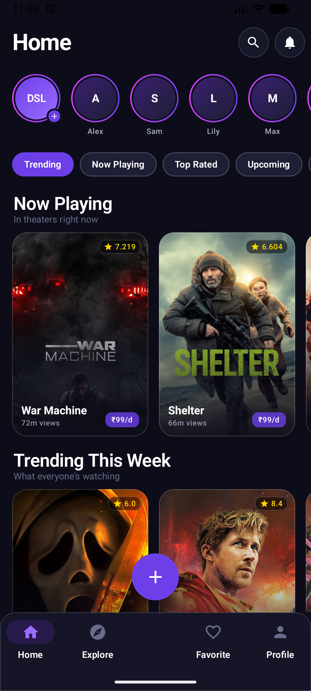
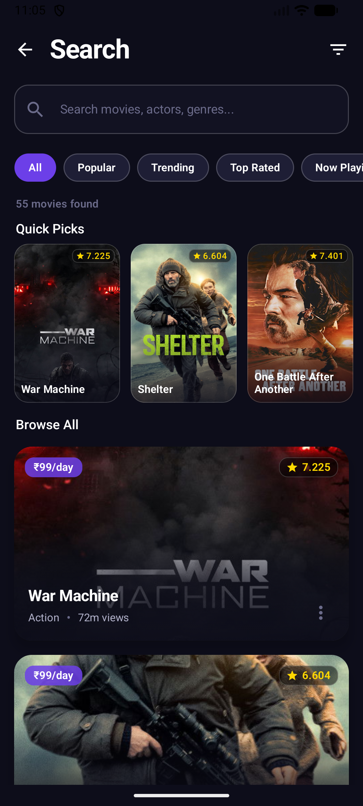
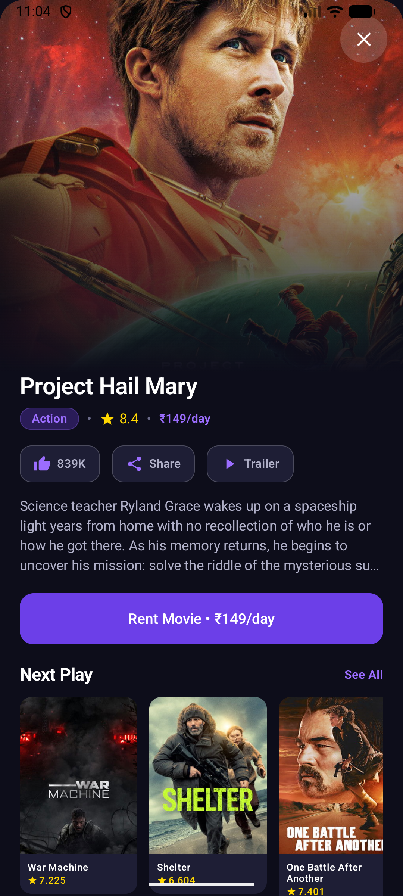
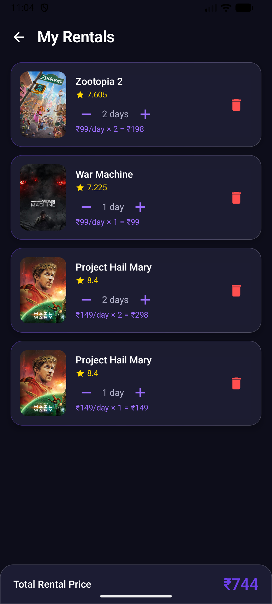
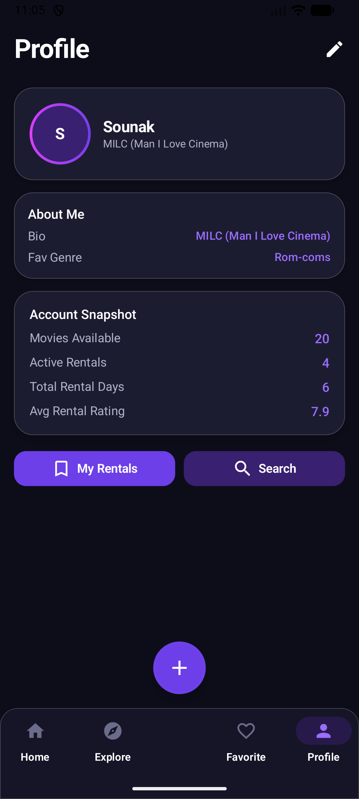

# Movie Explorer

A modern Android application for browsing, searching, and renting movies from the TMDB database. Built entirely with **Kotlin** and **Jetpack Compose**, featuring a premium dark-purple streaming interface with glassmorphism effects, smooth animations, and persistent user profiles.

---

## Download

> **[Download APK (v1.0)](https://github.com/krypton-arch/MovieExplorer/raw/main/app-release.apk)**

| | |
|---|---|
| **Version** | 1.0 |
| **Min Android** | 7.0 (API 24) |
| **Size** | ~12 MB |

> **Note:** This is an unsigned release build. You may need to enable "Install from unknown sources" in your device settings.

---

## Table of Contents

- [Features](#features)
- [Screenshots](#screenshots)
- [Architecture](#architecture)
- [Tech Stack](#tech-stack)
- [Project Structure](#project-structure)
- [Getting Started](#getting-started)
- [Configuration](#configuration)
- [Build](#build)
- [Dependencies](#dependencies)
- [License](#license)

---

## Features

### Browsing and Discovery
- Browse movies across **five TMDB categories**: Popular, Trending, Top Rated, Now Playing, and Upcoming
- Horizontal poster carousels for each category with bouncy entry animations
- Category-switching filter chips on the Home screen
- Featured movie card with gradient overlay on the Explore screen
- Story-ring row inspired by modern social media interfaces

### Search and Filtering
- Full-text search across all loaded movie categories (title + overview)
- Category-scoped search -- narrow results to Popular, Trending, Top Rated, or Now Playing
- "Quick Picks" horizontal poster row for browsing when no query is entered
- Compact glassmorphism result cards with poster, rating, price, and overview
- Advanced filter screen with minimum rating slider, "Quick Watch" toggle, and sort options

### Movie Details
- Tap any movie card to open a full-screen detail sheet
- Poster backdrop with gradient overlay
- Glassmorphism action chips (Play, Download, Share, Save)
- Genre pills, movie overview, and rental pricing
- "Next Play" section with horizontally-scrollable related movies

### Rental System
- Rent movies directly from any card or detail sheet
- Manage rental duration (increase/decrease days) per movie
- Remove rentals individually
- Real-time total price calculation in the rental screen
- Rental data persisted locally via Room database
- Background rental reminders via WorkManager (daily periodic check)

### User Profile
- Editable profile with name, bio, and favorite genre
- Profile data persisted via SharedPreferences across app restarts
- Dynamic avatar initials that update as you type
- Animated transitions between view and edit modes
- Account snapshot: total movies, active rentals, total days, average rating

### UI and Design
- Dark purple/navy aesthetic with gradient accents throughout
- Glassmorphism modifiers (semi-transparent surfaces with border glow)
- Staggered fade-in + slide-in animations on all list items
- Scale-on-press feedback on interactive cards
- Modern typography: **Outfit** for headings and labels, **Inter** for body text
- Tight letter-spacing and explicit line heights for a sleek feel
- Glassmorphism bottom navigation bar with rounded top corners

---

## Screenshots

<p align="center">
  
  &nbsp;&nbsp;
  
  &nbsp;&nbsp;
  
  &nbsp;&nbsp;
  
  &nbsp;&nbsp;
  
</p>

| Screen | Description |
|--------|-------------|
| **Home** | Story rings, category chips, "Now Playing" and "Trending" carousels |
| **Search** | Multi-category search with "Quick Picks" poster row |
| **Movie Detail** | Full poster backdrop, genre pills, action chips, "Next Play" section |
| **My Rentals** | Rental list with day controls and total price bar |
| **Profile** | Editable user profile with stats snapshot |

---

## Architecture

The project follows a layered architecture pattern:

```
UI Layer (Compose Screens + Components)
    |
ViewModel Layer (MovieViewModel)
    |
Repository Layer (MovieRepository)
    |
Data Layer (Retrofit API + Room Database)
```

**Data flow:**
- The `MovieViewModel` fetches movies from five TMDB API endpoints in parallel on initialization
- Each category is exposed as a separate `LiveData` stream
- Rental data flows reactively from Room via `StateFlow`
- Profile data is read/written to SharedPreferences directly from the Composable

---

## Tech Stack

| Layer | Technology |
|-------|-----------|
| Language | Kotlin |
| UI Framework | Jetpack Compose (Material 3) |
| Typography | Google Fonts (Outfit, Inter) |
| Navigation | Navigation Compose |
| Networking | Retrofit 2 + OkHttp + Gson |
| Image Loading | Coil Compose |
| Local Database | Room (KSP) |
| Background Work | WorkManager |
| State Management | LiveData, StateFlow |
| Min SDK | 24 (Android 7.0) |
| Target SDK | 36 |
| Build System | Gradle (Kotlin DSL) + Version Catalog |

---

## Project Structure

```
app/src/main/java/com/exmple/movieexplorer/
|
+-- MainActivity.kt                    # Entry point, navigation graph, WorkManager setup
|
+-- data/
|   +-- local/
|   |   +-- AppDatabase.kt             # Room database definition
|   |   +-- RentalDao.kt               # Data access object for rentals
|   +-- model/
|   |   +-- Movie.kt                   # Movie data class (TMDB response)
|   |   +-- RentalEntity.kt            # Room entity for rented movies
|   +-- remote/
|   |   +-- MovieApiService.kt         # Retrofit interface (5 TMDB endpoints)
|   |   +-- RetrofitInstance.kt         # Singleton Retrofit client
|   +-- repository/
|       +-- MovieRepository.kt         # Single source of truth for data operations
|
+-- viewmodel/
|   +-- MovieViewModel.kt              # UI state holder, parallel category loading
|   +-- MovieViewModelFactory.kt        # Factory for ViewModel instantiation
|
+-- ui/
|   +-- components/
|   |   +-- AppBottomBar.kt            # Glassmorphism bottom navigation
|   |   +-- GlassModifiers.kt          # Reusable glassmorphism + shimmer modifiers
|   |   +-- MovieCard.kt               # Poster-first card with gradient overlay
|   |   +-- MovieDetailSheet.kt        # Full-screen detail overlay
|   |   +-- RentalCard.kt              # Rental item with day controls
|   +-- screens/
|   |   +-- HomeScreen.kt              # Story row, carousels, category list
|   |   +-- ExploreScreen.kt           # Featured card, tabbed categories
|   |   +-- SearchScreen.kt            # Multi-category search with Quick Picks
|   |   +-- FilterScreen.kt            # Rating slider, sort chips, toggle
|   |   +-- RentalScreen.kt            # Rental list with total price bar
|   |   +-- ProfileScreen.kt           # Editable profile with stats
|   +-- theme/
|       +-- Color.kt                   # Full color palette (gradients, glass, shimmer)
|       +-- Theme.kt                   # MaterialTheme configuration
|       +-- Type.kt                    # Outfit + Inter typography scale
|
+-- worker/
    +-- RentalReminderWorker.kt        # Periodic background reminder
```

---

## Getting Started

### Prerequisites

- Android Studio Arctic Fox or later (Ladybug recommended)
- JDK 11+
- An active [TMDB API key](https://www.themoviedb.org/settings/api)

### Clone

```bash
git clone https://github.com/krypton-arch/MovieExplorer.git
cd MovieExplorer
```

### Configuration

Create a `local.properties` file in the project root (if it does not already exist) and add your TMDB API key:

```properties
TMDB_API_KEY=your_tmdb_api_key_here
```

> This key is read at build time via `gradleLocalProperties` and injected into `BuildConfig.TMDB_API_KEY`. It is not committed to version control.

---

## Build

**Debug build:**

```powershell
.\gradlew.bat assembleDebug
```

The APK will be generated at:

```
app/build/outputs/apk/debug/app-debug.apk
```

**Release build:**

```powershell
.\gradlew.bat assembleRelease
```

**Run on a connected device:**

```powershell
.\gradlew.bat installDebug
```

---

## Dependencies

All dependencies are managed via [Gradle Version Catalog](gradle/libs.versions.toml).

| Dependency | Purpose |
|-----------|---------|
| Jetpack Compose BOM | UI toolkit with Material 3 |
| Compose UI Text Google Fonts | Outfit and Inter font loading |
| Navigation Compose | Screen routing and back-stack |
| Room + KSP | Local SQLite database for rentals |
| Retrofit 2 + Gson | REST API communication with TMDB |
| OkHttp Logging Interceptor | Network request logging |
| Coil Compose | Async image loading from TMDB CDN |
| WorkManager | Background rental reminders |
| Material Icons Extended | Full icon set |

---

## API Endpoints

The app communicates with the [TMDB API v3](https://developers.themoviedb.org/3):

| Endpoint | Category |
|----------|----------|
| `GET movie/popular` | Most Popular |
| `GET trending/movie/week` | Trending This Week |
| `GET movie/top_rated` | Top Rated |
| `GET movie/now_playing` | Now Playing |
| `GET movie/upcoming` | Coming Soon |

---

## License

This project is intended for educational and portfolio purposes.

---

<p align="center">
  <sub>Built with Kotlin, Jetpack Compose, and the TMDB API</sub>
</p>
